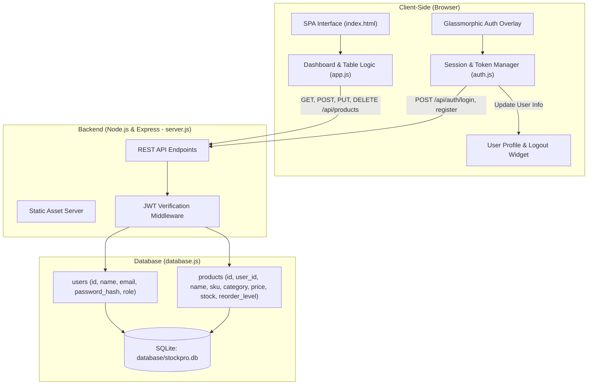

# 📦 StockPro - Inventory Management & Dashboard System

A modern, fast, and responsive web application for real-time inventory tracking, stock analytics, user authentication, and data management. Built with a glassmorphic dark UI, vanilla JavaScript Single-Page Application (SPA) frontend, a lightweight Node.js/Express backend, and an embedded SQLite database engine.

---

## 🌟 Key Features

* **🔐 User Authentication & Account Isolation**
  * Dedicated glassmorphic **Sign In** and **Create Account** interface.
  * Passwords securely hashed with `bcryptjs` (10 salt rounds).
  * Stateless session management via JSON Web Tokens (**JWT**).
  * Isolated inventory records per user account.
  * **⚡ Quick Demo Sign In** for immediate 1-click evaluation.
  * Header user profile badge with avatar and safe **Sign Out** flow.

* **📦 Comprehensive Inventory Management**
  * Complete CRUD operations (Create, Read, Update, Delete) for inventory items.
  * Automatic uniqueness validation for SKU codes per user.
  * Stock status indicators with visual badges (`In Stock`, `Low Stock Alert`, `Out of Stock`).
  * Live multi-criteria filtering: real-time search (by name or SKU), category filter, and stock status filter.

* **📊 Real-Time Analytics & Dashboard**
  * **KPI Summary Cards**: Total products, total inventory valuation (₹), total physical units, and low-stock count.
  * **Low-Stock Alert List**: Immediate visibility into items falling at or below their reorder threshold.
  * **Dynamic SVG Category Valuation Chart**: Custom programmatic SVG bar chart with responsive gridlines, price scales, and hover tooltips.
  * **Stock Overview Table**: Quick glance at the most recent inventory records.

* **💾 Embedded SQL Database Engine**
  * Powered by Node 24's native `node:sqlite` (`DatabaseSync`), requiring **zero** external database servers or complex C++ build tools.
  * Stored in a single file (`database/stockpro.db`) with Write-Ahead Logging (WAL) and Foreign Key enforcement.
  * Parameterized queries to prevent SQL injection vulnerabilities.

* **🎨 Responsive Glassmorphic UI/UX**
  * Modern dark theme with CSS custom properties, backdrop blur filters, and subtle gradients.
  * Dual navigation system: desktop sidebar and mobile bottom navigation bar with slide-out drawer.
  * Debounced SVG chart redraw on browser window resize.

* **🔄 Backup & Migration**
  * **Export Database**: One-click download of the complete inventory database as a formatted `.json` backup file.
  * **Import Database**: Upload and sync JSON backup data directly into the SQLite database.

---

## 🏗️ Architecture & Data Flow



---

## 🛠️ Technology Stack

| Layer | Technology | Purpose |
| :--- | :--- | :--- |
| **Frontend UI** | HTML5, CSS3 | Glassmorphic design system, responsive grid layouts, custom SVG charts. |
| **Frontend Logic** | Vanilla JavaScript (ES6+) | Client-side routing, DOM updates, live table filters, event handling. |
| **Backend Framework** | Node.js (v22+/v24+) & Express 5 | REST API endpoints, static file serving, CORS, JSON body parsing. |
| **Database** | SQLite (`node:sqlite`) | Serverless, single-file relational database (`stockpro.db`) with WAL mode. |
| **Authentication** | `jsonwebtoken` (JWT) | Stateless authentication via Bearer tokens. |
| **Password Security** | `bcryptjs` | Salted one-way password hashing. |

---

## 🗄️ Database Schema

### `users` Table
| Column | Type | Constraints | Description |
| :--- | :--- | :--- | :--- |
| `id` | `TEXT` | `PRIMARY KEY` | Unique user identifier (e.g. `usr_1788...`) |
| `name` | `TEXT` | `NOT NULL` | User's full name |
| `email` | `TEXT` | `UNIQUE NOT NULL COLLATE NOCASE` | Unique login email address |
| `password_hash`| `TEXT` | `NOT NULL` | bcrypt salted password hash |
| `role` | `TEXT` | `DEFAULT 'admin'` | User access role |
| `created_at` | `DATETIME`| `DEFAULT CURRENT_TIMESTAMP` | Account creation timestamp |
| `updated_at` | `DATETIME`| `DEFAULT CURRENT_TIMESTAMP` | Last profile update timestamp |

### `products` Table
| Column | Type | Constraints | Description |
| :--- | :--- | :--- | :--- |
| `id` | `TEXT` | `PRIMARY KEY` | Unique product identifier (e.g. `p_1788...`) |
| `user_id` | `TEXT` | `NOT NULL, FOREIGN KEY (users.id) CASCADE` | Owner user ID |
| `name` | `TEXT` | `NOT NULL` | Product name |
| `sku` | `TEXT` | `NOT NULL` | Stock Keeping Unit code (unique per user) |
| `category` | `TEXT` | `NOT NULL` | Category name |
| `price` | `REAL` | `NOT NULL DEFAULT 0.0` | Unit selling price (₹) |
| `stock` | `INTEGER`| `NOT NULL DEFAULT 0` | Available stock count |
| `reorder_level`| `INTEGER`| `NOT NULL DEFAULT 5` | Low-stock alert threshold |
| `created_at` | `DATETIME`| `DEFAULT CURRENT_TIMESTAMP` | Creation timestamp |
| `updated_at` | `DATETIME`| `DEFAULT CURRENT_TIMESTAMP` | Last update timestamp |

---

## 📡 REST API Reference

### Authentication (`/api/auth`)

* **`POST /api/auth/register`**
  * Registers a new user, hashes password, auto-seeds default inventory data, and returns a 7-day JWT token.
  * *Body*: `{ "name": "...", "email": "...", "password": "..." }`
* **`POST /api/auth/login`**
  * Validates credentials and returns JWT bearer token + user profile.
  * *Body*: `{ "email": "...", "password": "..." }`
* **`GET /api/auth/me`**
  * Returns authenticated user profile.
  * *Header*: `Authorization: Bearer <token>`

### Products (`/api/products`) — *All endpoints require JWT Bearer token*

* **`GET /api/products`**: Fetch all products owned by the authenticated user.
* **`POST /api/products`**: Create a new product. Validates SKU uniqueness.
  * *Body*: `{ "name": "...", "sku": "...", "category": "...", "price": 99.99, "stock": 10, "reorderLevel": 5 }`
* **`PUT /api/products/:id`**: Update product details. Validates SKU conflict.
* **`DELETE /api/products/:id`**: Delete a product from SQLite.
* **`POST /api/products/sync`**: Bulk import and sync products array into the database.

---

## 📂 Project Directory Structure

```text
inventory-billing-app/
├── database/
│   └── stockpro.db           # SQLite database file (auto-generated)
├── app.js                    # Inventory dashboard, chart, tables, and CRUD logic
├── auth.js                   # Client authentication controller & session handling
├── database.js               # SQLite database engine & queries (node:sqlite)
├── index.html                # Single Page Application HTML markup & auth overlay
├── mockData.js               # Initial seed products & billing models
├── package.json              # Project dependencies & npm scripts
├── server.js                 # Express backend server with Auth & Products APIs
├── style.css                 # Dark glassmorphic design system & layout styles
└── README.md                 # Project documentation
```

---

## 🚀 Getting Started

### Prerequisites
* **Node.js**: v22.0.0 or higher (v24+ recommended for native `node:sqlite` support).
* **npm**: v10.0.0 or higher.

### 1. Installation
Clone or open the project folder in your terminal, then install dependencies:
```bash
npm install
```

### 2. Start the Application
Start the Node.js Express server:
```bash
npm start
```

### 3. Open in Browser
Navigate to:
```
http://localhost:3000
```

### 4. Logging In
* **Quick Demo**: Click the **⚡ Quick Demo Sign In** button on the login screen to sign in instantly with demo credentials (`admin@stockpro.com` / `admin123`).
* **Create Account**: Switch to the **Create Account** tab, enter your details, and register a new account.

---

## 🔮 Future Roadmap

* **Billing & Invoicing Engine**: Create, manage, and print invoices with dynamic tax & discount calculations.
* **Customer Directory**: Customer profile management linked to invoice records.
* **PDF Export**: Generate downloadable invoice receipts directly from the browser.
* **Multi-user Roles**: Granular permissions for Admin and Staff members.

---

## 📄 License
This project is licensed under the [ISC License](LICENSE).
