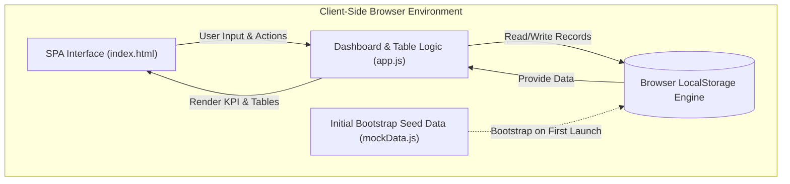

# 📦 StockPro - Inventory Management & Dashboard System

A modern, fast, and responsive web application for real-time inventory tracking, stock analytics, and data management. Built with a sleek glassmorphic dark UI, vanilla JavaScript Single-Page Application (SPA) frontend, and an offline-first **LocalStorage** persistence engine with zero database server dependencies.

---

## 🌟 Key Features

* **🔐 User Authentication & LocalStorage Session Management**
  * Modern glassmorphic **Sign In** and **Create Account** interface with password visibility toggles.
  * Instant **⚡ Quick Demo Sign In** for 1-click evaluation (`admin@stockpro.com` / `admin123`).
  * Account validation with duplicate email checks and password verification.
  * Header user profile badge displaying user avatar initials, name, role ("Admin"), and a smooth **Sign Out** flow.
  * Persistent sessions stored directly in `localStorage` (`stockpro_user`, `stockpro_token`).

* **📦 Comprehensive Inventory Management**
  * Complete CRUD operations (Create, Read, Update, Delete) for inventory items.
  * Instant, offline data persistence directly in the browser via `localStorage`.
  * Automatic uniqueness validation for SKU codes.
  * Stock status indicators with visual badges (`In Stock`, `Low Stock Alert`, `Out of Stock`).
  * Live multi-criteria filtering: real-time search (by name or SKU), category filter, and stock status filter.

* **📊 Real-Time Analytics & Dashboard**
  * **KPI Summary Cards**: Total products, total inventory valuation (₹), total physical units, and low-stock count.
  * **Low-Stock Alert List**: Immediate visibility into items falling at or below their reorder threshold.
  * **Dynamic SVG Category Valuation Chart**: Custom programmatic SVG bar chart with responsive gridlines, price scales, and hover tooltips.
  * **Stock Overview Table**: Quick glance at the most recent inventory records.

* **💾 Pure LocalStorage Engine**
  * Powered entirely by the Web Storage API (`localStorage`), requiring **zero** external database servers, SQLite binaries, or backend runtimes.
  * Automatic fallback initialization with bootstrap seed data on first launch.
  * Instant read and write performance with zero network latency.

* **🎨 Responsive Glassmorphic UI/UX**
  * Modern dark theme with CSS custom properties, backdrop blur filters, and subtle gradients.
  * Dual navigation system: desktop sidebar and mobile bottom navigation bar with slide-out drawer.
  * Debounced SVG chart redraw on browser window resize.

* **🔄 Backup & Migration**
  * **Export Data**: One-click download of the complete inventory dataset as a formatted `.json` backup file.
  * **Import Data**: Upload and restore JSON backup data directly into your browser's local storage.

---

## 🏗️ Architecture & Data Flow



---

## 🛠️ Technology Stack

| Layer | Technology | Purpose |
| :--- | :--- | :--- |
| **Frontend UI** | HTML5, CSS3 | Glassmorphic design system, responsive grid layouts, custom SVG charts. |
| **Frontend Logic** | Vanilla JavaScript (ES6+) | Client-side navigation, DOM updates, live table filters, event handling. |
| **Storage Engine** | Browser LocalStorage API | Fast, offline-first client-side persistent storage. |
| **Initial Data** | `mockData.js` | Bootstrap dataset for immediate first-launch experience. |

---

## 🗄️ LocalStorage Data Models

### `products` Storage Item
The inventory catalog is serialized as a JSON array under the `"products"` key in `localStorage`:

```json
[
  {
    "id": "p_1725732000000",
    "name": "Wireless Ergonomic Mouse",
    "sku": "MS-W-01",
    "category": "Computer Accessories",
    "price": 49.99,
    "stock": 35,
    "reorderLevel": 10,
    "createdAt": "2026-09-07T18:00:00.000Z",
    "updatedAt": "2026-09-07T18:00:00.000Z"
  }
]
```

### Properties Reference
| Field | Type | Description |
| :--- | :--- | :--- |
| `id` | `String` | Unique product identifier (timestamp-based or seed ID) |
| `name` | `String` | Product name |
| `sku` | `String` | Stock Keeping Unit code (unique across inventory) |
| `category` | `String` | Product category |
| `price` | `Number` | Unit selling price in currency units (₹) |
| `stock` | `Number` | Current available quantity in inventory |
| `reorderLevel` | `Number` | Minimum threshold for low-stock warnings |
| `createdAt` | `String` | ISO timestamp of product creation |
| `updatedAt` | `String` | ISO timestamp of last update |

---

## 📂 Project Directory Structure

```text
inventory-billing-app/
├── app.js                    # Inventory dashboard, chart, tables, and LocalStorage CRUD logic
├── auth.js                   # Client authentication module (LocalStorage powered)
├── index.html                # Single Page Application HTML markup
├── mockData.js               # Initial seed products & mock data models
├── package.json              # Project manifest & scripts
├── style.css                 # Dark glassmorphic design system & layout styles
└── README.md                 # Project documentation
```

---

## 🚀 Getting Started

### Prerequisites
Any modern web browser (Google Chrome, Mozilla Firefox, Microsoft Edge, Safari). No database servers or background daemons are needed!

### 1. Launch Directly
Double click `index.html` to open it in any web browser.

### 2. Or Run via Local Web Server (Optional)
If you prefer running via a local static web server:
```bash
npx serve .
```
Or with Python:
```bash
python -m http.server 3000
```
Open [http://localhost:3000](http://localhost:3000) in your browser.

---

## 🔮 Future Roadmap

* **Billing & Invoicing Engine**: Create, manage, and print invoices with dynamic tax & discount calculations.
* **Customer Directory**: Customer profile management linked to invoice records in LocalStorage.
* **PDF Export**: Generate downloadable invoice receipts directly from the browser.

---

## 📄 License
This project is licensed under the [ISC License](LICENSE).
